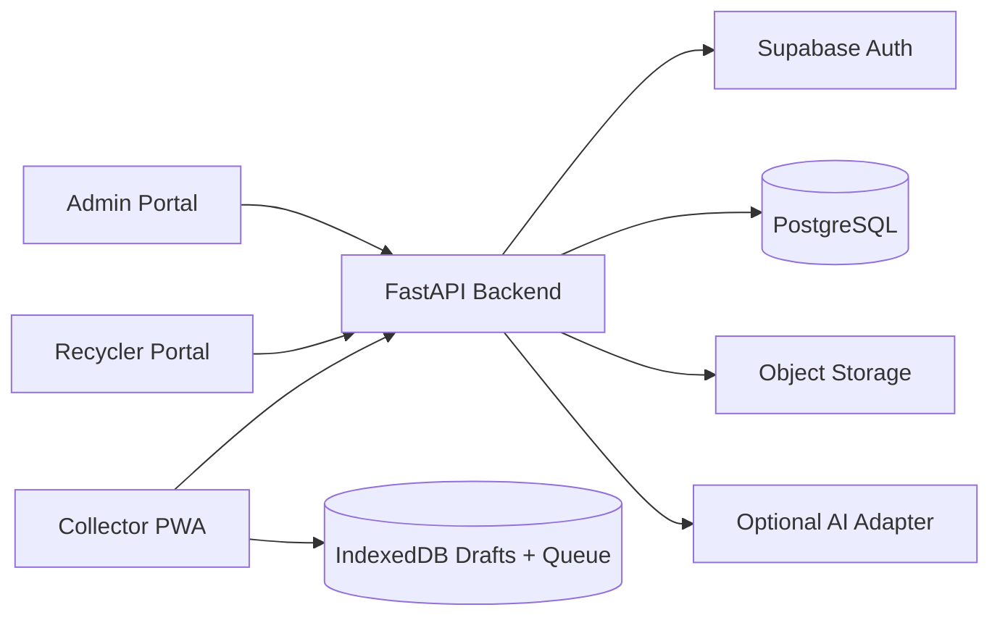
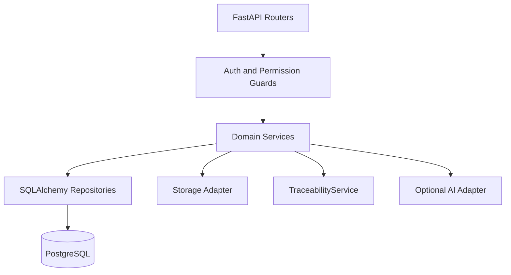
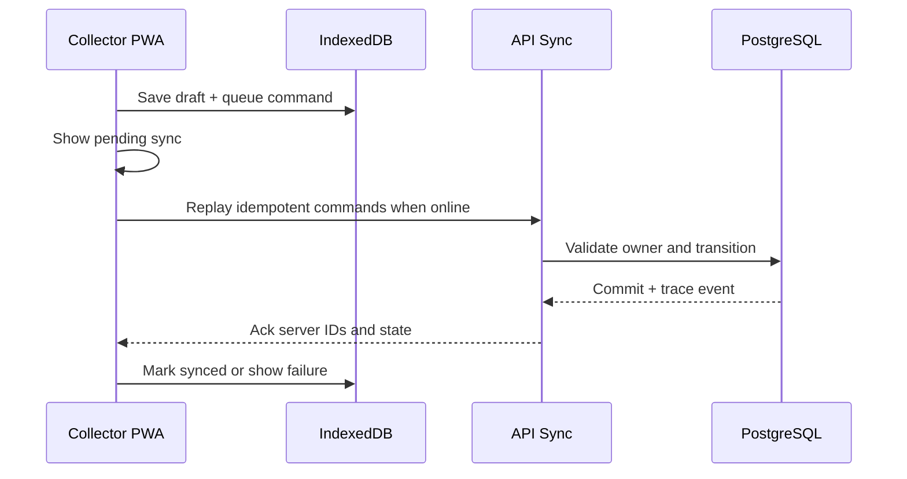

# Architecture

## System Context

The platform connects informal e-waste collectors with authorized recyclers through one Digital E-Waste Lot workflow: PROOF -> PRICE -> MATCH -> HANDOVER -> PAYOUT -> PROOF OF RECYCLING. The MVP is a single React PWA frontend family backed by one FastAPI application, Supabase Auth, Supabase PostgreSQL, and Supabase Storage.

## Frontends

Collector frontend is mobile-first, offline-aware, and optimized for simple touch workflows: create draft, add evidence, confirm classification, review price, list lot, accept offer, show QR, and view traceability. It stores local drafts and queued mutations in IndexedDB and syncs when online.

Recycler frontend supports marketplace browsing, evidence review, offer submission, accepted lot handling, receipt, physical weight verification, processing, and recycling evidence upload.

Admin frontend supports recycler verification, anomaly review, lot audit, transaction audit, and trace timeline inspection. Admin tools must be authorization-gated and audit-oriented.

## Backend Application

FastAPI is one backend application with clean domain modules, not microservices. Domain services are: LotTransitionService, VerificationService, PricingService, MatchingService, OfferService, TransactionService, HandoverService, PaymentService, TraceabilityService, RecyclingService, NotificationService, and SyncService.

## Data and Storage

PostgreSQL stores authoritative entities, transitions, offers, transactions, payments, and append-only trace events. Supabase Storage stores uploaded lot images and recycling evidence; database rows store ownership, object path, hashes, and verification metadata. Database constraints enforce ownership, uniqueness, and key invariants where practical; transition correctness is enforced by the backend service.

## Offline Layer and Sync

IndexedDB stores collector draft lots, draft images, and a mutation queue. Each local operation receives a client-generated UUID and idempotency key. On connectivity restored, SyncService sends queued commands in order. Backend responses map local IDs to server IDs, acknowledge each mutation, and return conflicts explicitly. Recycler transactions are not fully offline in the MVP.

## Engines

Verification engine calculates a confidence score using image quality, exact duplicate hash, perceptual hash, e-waste/category classification, multi-angle evidence, and plausibility. Optional AI classification may improve labels but must not block deterministic fallback scoring.

Pricing engine calculates deterministic low/mid/high fair-value range from demo reference prices, condition, quantity, and optional region factor. Matching engine ranks recyclers by material capability, service region, minimum quantity, authorization status, pickup ability, and price fit. Transaction engine creates the accepted-offer commercial record. Traceability engine appends immutable events for every material state change.

Payment simulation records demo transactions only. Recycling evidence attaches recycler-submitted proof after processing and enables lot closure.

## Responsibility Boundaries

### Client Responsibilities

- Present persona-specific screens and accessible states.
- Capture evidence and offline drafts.
- Maintain IndexedDB draft store and sync queue.
- Call explicit API commands, never mutate lifecycle status directly.
- Show loading, success, failure, empty, and offline states.

### Backend Responsibilities

- Authenticate and authorize every command.
- Enforce lifecycle preconditions through LotTransitionService.
- Run verification, pricing, matching, offers, transactions, handover, payments, recycling, and trace services.
- Validate uploads, idempotency keys, object ownership, and command permissions.
- Return explicit errors; never silently swallow failures.

### Database Responsibilities

- Persist authoritative entities and append-only trace history.
- Enforce foreign keys, uniqueness, required fields, indexes, and timestamps.
- Preserve historical truth for trace events, payments, handovers, and recycling evidence.
- Store demo flags for synthetic/reference data.

### Optional External AI Responsibilities

- Provide e-waste/category classification hints only.
- Return confidence and explanation metadata when available.
- Fail closed into deterministic fallback checks without blocking the golden path.

## MVP vs Production Extension

MVP uses one backend, deterministic seed data, simulated payments, demo reference prices, and optional AI fallback. Production extensions may add government registry verification, live market feeds, stronger fraud models, logistics integrations, real payment settlement, and advanced EPR reporting. Do not implement production extensions during Phase 1 unless the golden path is complete and explicitly requested.